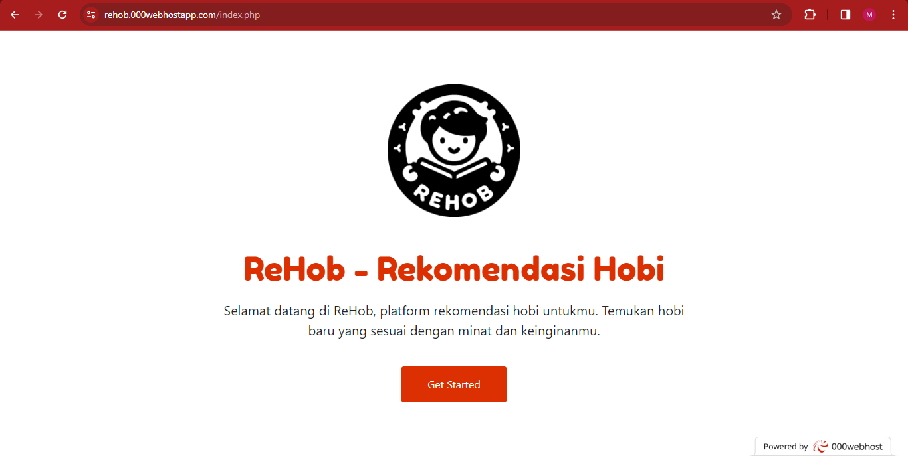
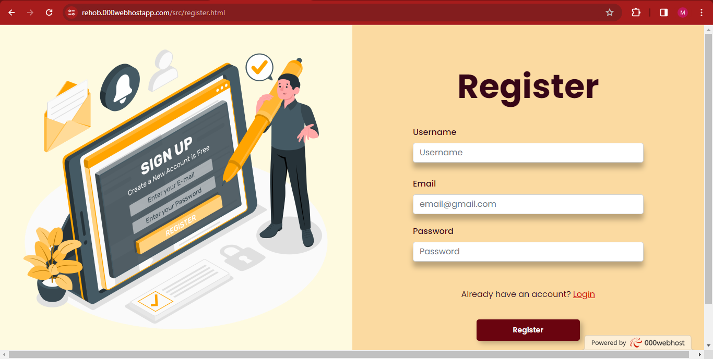
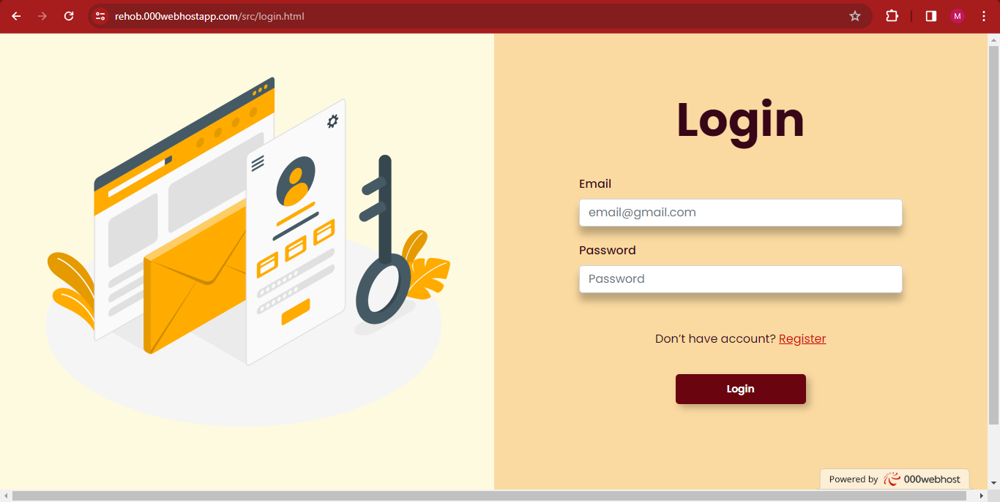
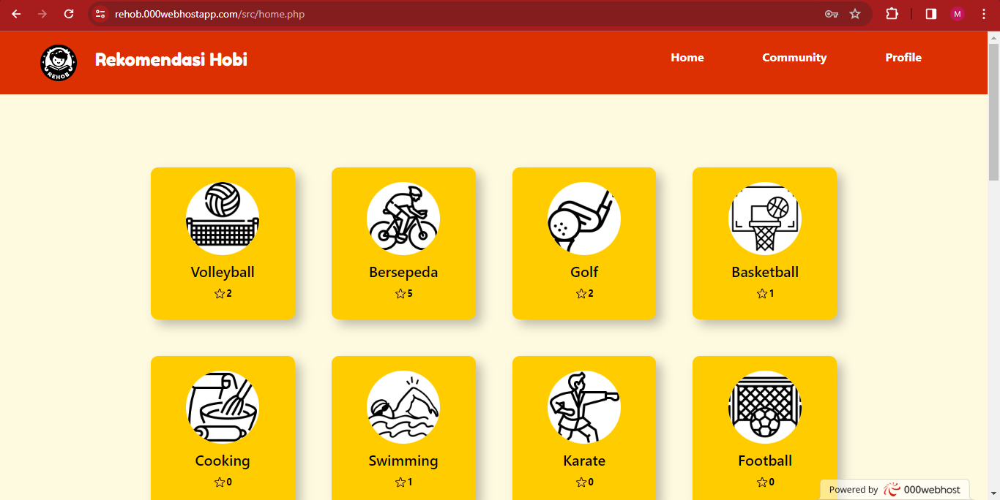
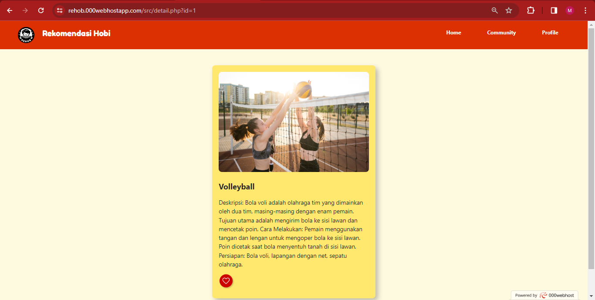
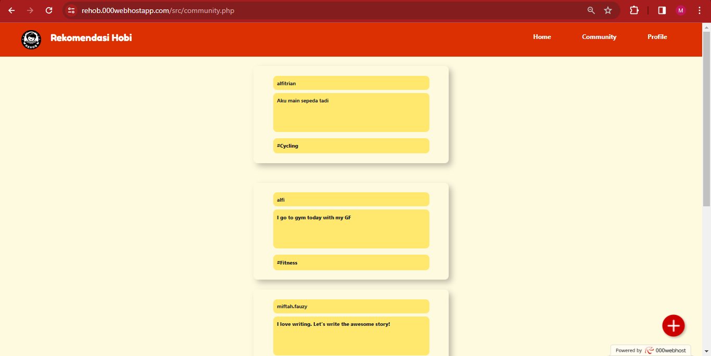
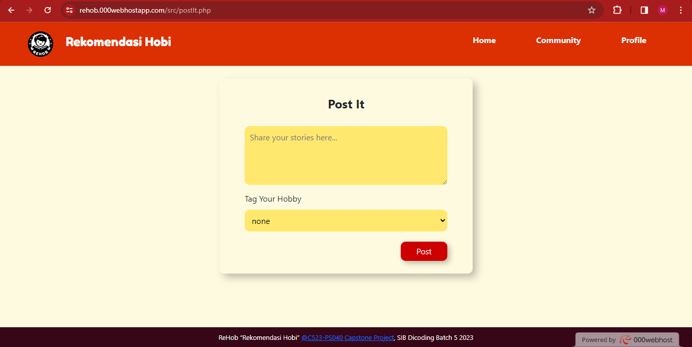
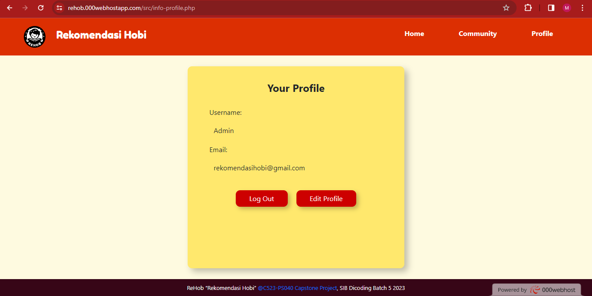
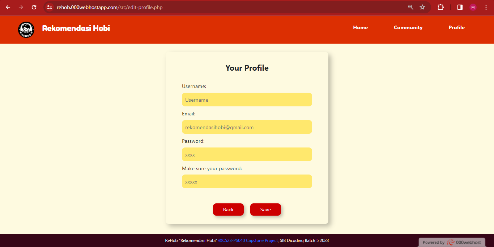
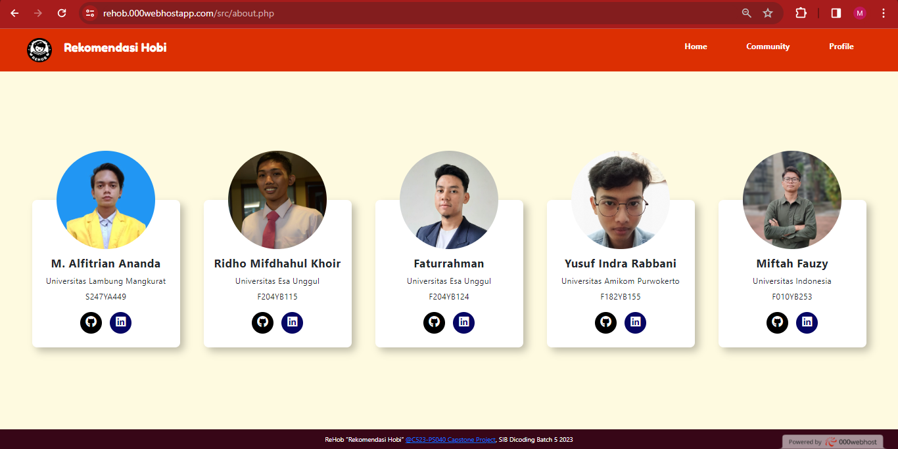

# REHOB - Aplikasi Rekomendasi Hobi

REHOB, singkatan dari Aplikasi Rekomendasi Hobi, merupakan platform inovatif yang dirancang khusus untuk membantu pengguna menemukan dan mengejar hobi yang sesuai dengan minat pribadi mereka. Dengan menyediakan panduan langkah demi langkah yang mudah dipahami, REHOB memberikan pengalaman pencarian rekomendasi hobi yang menyenangkan dan memuaskan. Aplikasi ini dikembangkan oleh kelompok MSIB Dicoding.

## Petunjuk Penggunaan

### A. Masuk ke Aplikasi REHOB

1. Buka laman website [REHOB](https://rehob.000webhostapp.com).
2. Klik pada bagian "Get Started ReHob" untuk memulai aplikasi.

### B. Registrasi pada Aplikasi REHOB

1. Pada halaman Register, isi formulir pendaftaran dengan username, email, dan password.
2. Klik tombol "Register".

### C. Login pada Aplikasi REHOB

1. Pada halaman Login, masukkan email dan password yang telah didaftarkan.
2. Klik tombol "Login".

### D. Tampilan Home pada Aplikasi REHOB

Setelah login, Anda akan diarahkan ke halaman Home Page yang menampilkan berbagai hobi.

### E. Tampilan Deskripsi

Klik pada salah satu card hobi untuk melihat deskripsi. Anda juga dapat memberikan like pada hobi tersebut.

### F. Tampilan Fitur Community

Fitur Community memungkinkan pengguna terlibat dalam komunitas yang berbagi minat dan hobi serupa.

### G. Tampilan Post-It

Pada fitur Community, klik tanda "+" untuk menambahkan postingan atau kegiatan hobi.

### H. Tampilan Profil

Lihat informasi profil pengguna, logout, dan edit profil pada halaman Profil.

### I. Tampilan Edit Profile

Edit informasi profil pengguna pada halaman Edit Profile.

### J. Tampilan Tentang Kami

Lihat informasi tentang kelompok pengembang aplikasi pada halaman Tentang Kami.

## Kontributor

- Muhammad Alfitrian Ananda - S247YA449 - Universitas Lambung Mangkurat
- Miftah Fauzy - F010YB253 - Universitas Indonesia
- Faturrahman - F204YB124 - Universitas Esa Unggul
- Yusuf Indra Rabbani - F182YB155 - Universitas Amikom Purwokerto
- Ridho Mifdhahul Khoir - F204YB115 - Universitas Esa Unggul

---

**Catatan:** Email tidak bisa diganti, jadi gunakan email atau username yang belum pernah terdaftar jika ingin membuat akun lagi

# Project Plan

## Deskripsi Aplikasi

### Problem Statement
Banyak individu mengalami kesulitan dalam memilih hobi yang sesuai dengan minat mereka, sehingga menghambat kepuasan hidup mereka. Ketidakpastian dalam memilih hobi baru seringkali menjadi hambatan yang signifikan. Problem statement proyek "Rekomendasi Hobi (REHOB)" adalah bagaimana memberikan solusi sederhana dan efektif untuk membantu pengguna menemukan dan menjalani hobi yang sesuai dengan minat mereka.

### Research Questions
- Bagaimana kita dapat menyusun kumpulan hobi yang menarik dan beragam untuk pengguna?
- Bagaimana kita dapat memfasilitasi pengguna untuk berbagi dan berinteraksi terkait dengan hobi mereka dalam aplikasi?
- Bagaimana "Rekomendasi Hobi (REHOB)" dapat menjadi sumber inspirasi bagi pengguna dalam mengeksplorasi hobi baru?
- Bagaimana aplikasi ini dapat memberikan nilai tambah kepada komunitas hobi yang ada?

### Latar Belakang
Gaya hidup yang seimbang dan memuaskan menjadi semakin penting bagi banyak orang. Mengejar hobi yang sesuai dengan minat pribadi adalah salah satu langkah menuju tujuan ini. Namun, ketidakpastian dalam memilih hobi baru seringkali menjadi hambatan yang signifikan. "Rekomendasi Hobi (REHOB)" lahir dari kesadaran akan kebutuhan akan panduan yang sederhana dan efektif dalam menemukan dan menjalani hobi yang memuaskan.

### Mengapa Tim Kami Memilih Proyek Ini
Proyek "Rekomendasi Hobi (REHOB)" memiliki potensi besar untuk memberikan manfaat kepada individu yang mencari hobi yang sesuai dengan minat pribadi mereka. Dengan fokus pada penyediaan konten hobi yang menarik dan fasilitasi komunitas pengguna dalam berbagi dan berinteraksi, aplikasi ini dapat menjadi wadah yang bermanfaat bagi mereka yang ingin mengeksplorasi hobi atau berbagi minat mereka. Tim kami memiliki minat dan pengalaman dalam memahami masalah ini, dan kami yakin bahwa "Rekomendasi Hobi (REHOB)" dapat menjadi sumber inspirasi dan wadah bagi banyak orang untuk menjalani hobi yang memuaskan. Kami percaya bahwa membangun "Rekomendasi Hobi (REHOB)" adalah langkah yang tepat untuk membantu individu mencapai kepuasan hidup melalui hobi yang sesuai dengan minat pribadi mereka.

## CAKUPAN PROYEK & HASIL KERJA

### Cakupan Proyek
1. **Pengembangan Konten Hobi:** Tim kami akan menyusun kumpulan hobi yang beragam dan menarik yang akan disajikan kepada pengguna melalui website. Ini termasuk deskripsi, gambar, dan sumber daya terkait hobi.
2. **Fasilitasi Komunitas:** Aplikasi akan memiliki fitur yang memungkinkan pengguna untuk berbagi pengalaman mereka dengan hobi, dan berinteraksi dengan pengguna lain.
3. **Desain UI/UX:** Kami akan merancang antarmuka pengguna yang intuitif dan menarik untuk memastikan pengalaman pengguna yang baik.
4. **Pengembangan Aplikasi:** Kami akan mengembangkan aplikasi "Rekomendasi Hobi (REHOB)" dengan menggunakan bahasa pemrograman JavaScript dan Native untuk front-end, serta PHP untuk back-end. Kami juga akan mengintegrasikan database untuk penyimpanan konten hobi.
5. **Pengujian dan Perbaikan:** Setelah pengembangan, kami akan melakukan pengujian menyeluruh untuk memastikan aplikasi berfungsi dengan baik dan aman. Kami akan memperbaiki masalah yang ditemukan selama pengujian.
6. **Peluncuran dan Pemasaran:** Setelah pengujian yang memadai, kami akan meluncurkan aplikasi "Rekomendasi Hobi (REHOB)" dan memulai kampanye pemasaran untuk memperkenalkan aplikasi kepada pengguna potensial (dimulai dari orang-orang terdekat kami).

### Milestone
- **Minggu 1:** Selesai menyusun kumpulan hobi.
- **Minggu 2:** Selesai pengembangan fitur komunitas.
- **Minggu 3:** Selesai desain UI/UX dan pengembangan aplikasi.
- **Minggu 4:** Selesai pengujian, perbaikan, dan peluncuran.
- **Minggu 5:** Mulai kampanye pemasaran.

Terima kasih atas perhatiannya, dan kami berharap "Rekomendasi Hobi (REHOB)" dapat menjadi solusi yang bermanfaat bagi mereka yang mencari kepuasan hidup melalui hobi yang sesuai dengan minat pribadi mereka.
